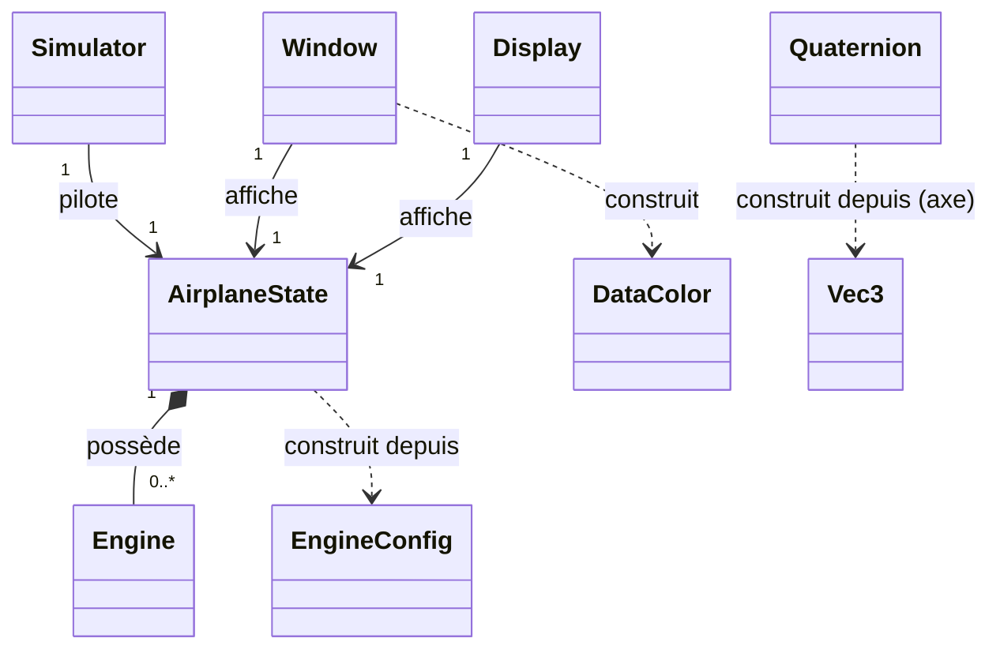
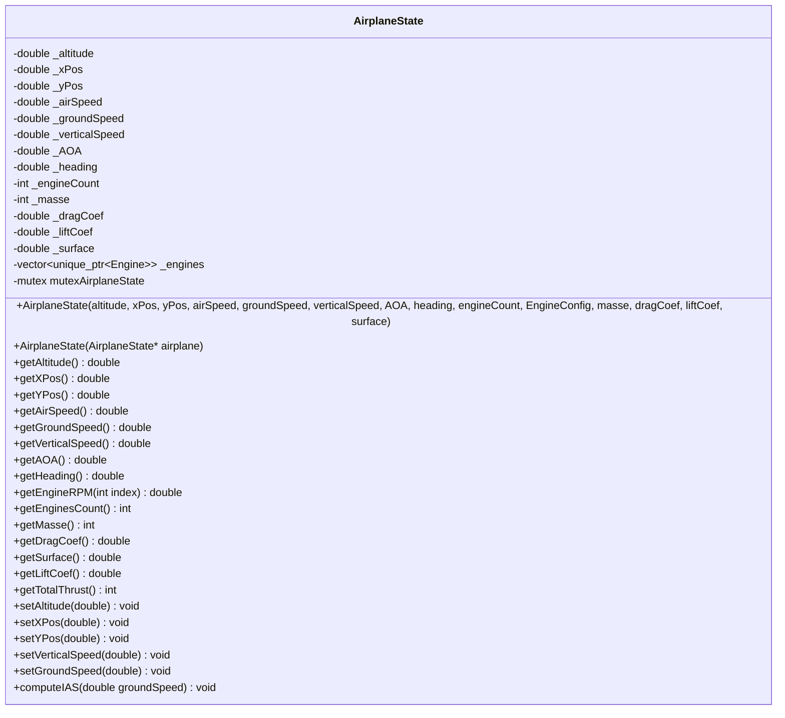
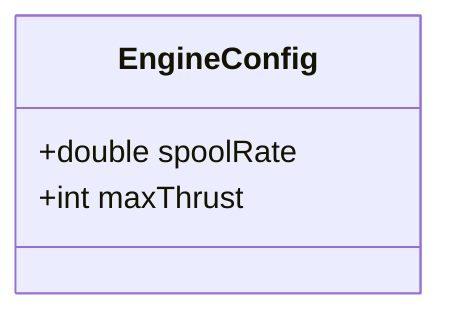
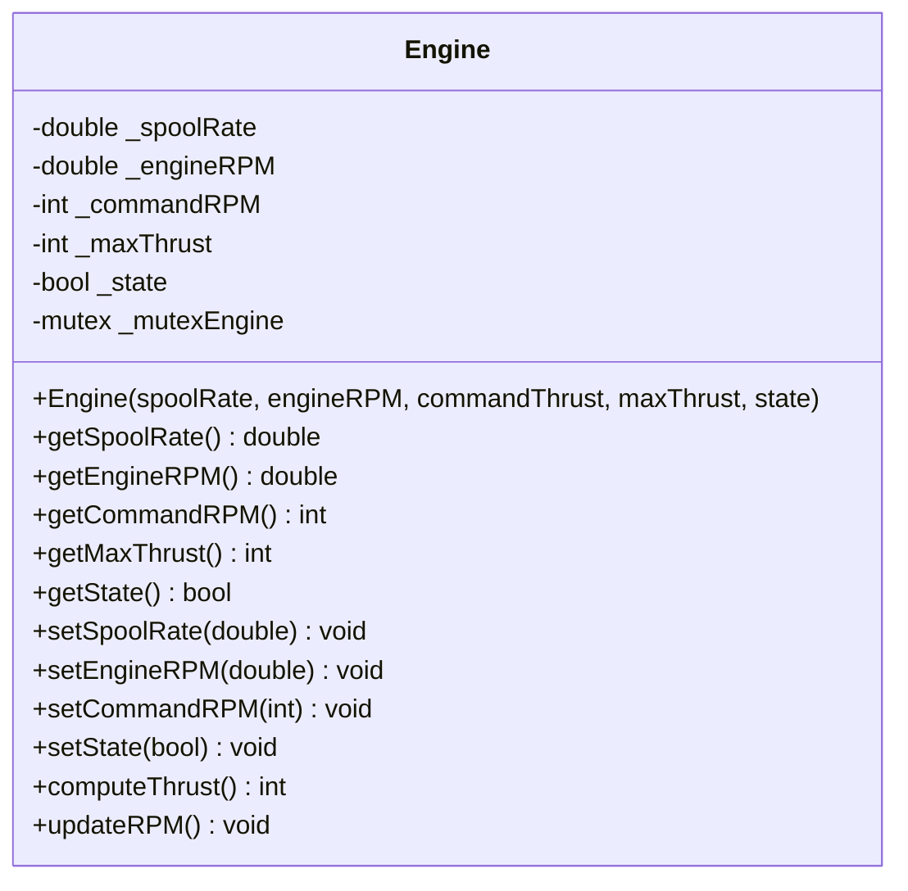
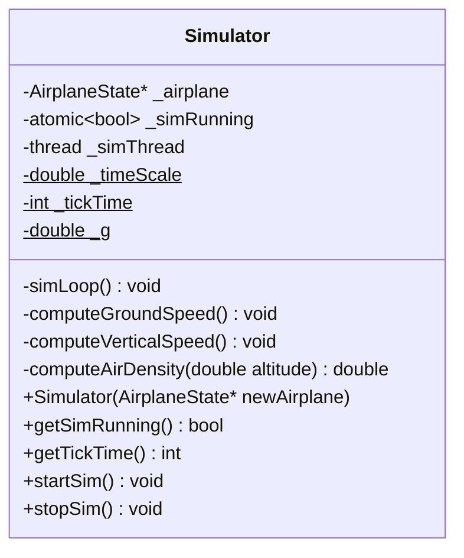
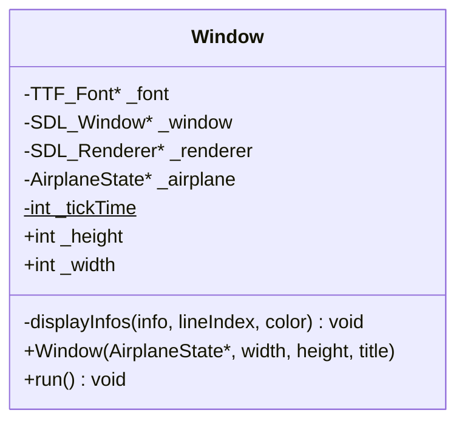
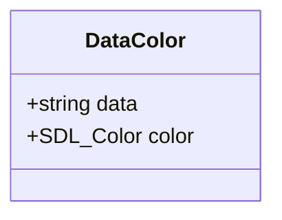
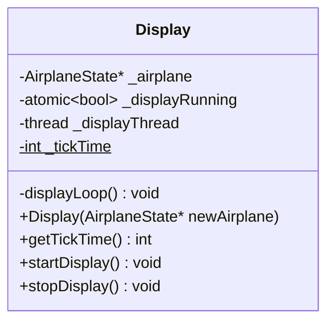
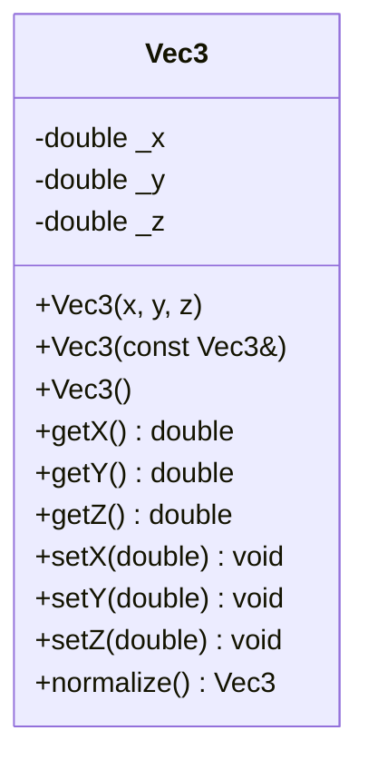
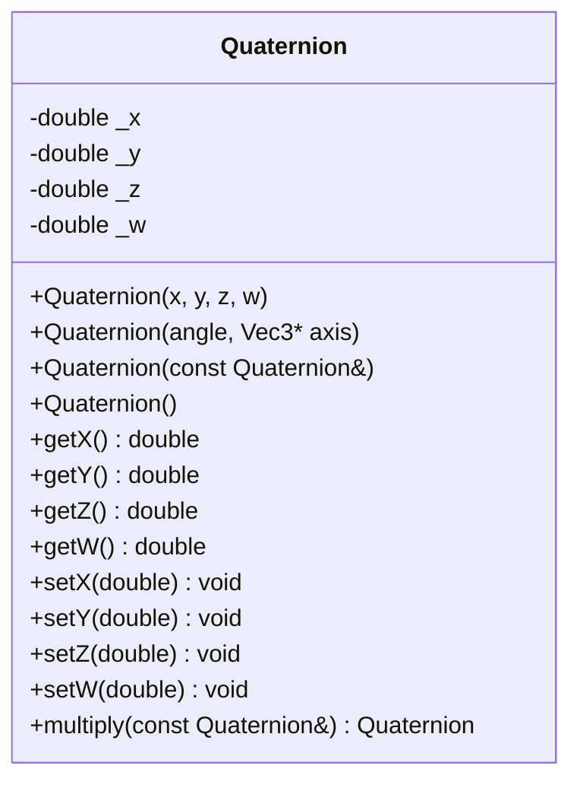

# Diagramme de classes

Généré depuis l'état actuel du code (`src/`). Contrairement à `docs/classDiagram.svg` (export figé, périmé), ce fichier est la source Mermaid — GitHub le rend nativement, et il se diff/modifie comme du texte normal.

Structure : une vue d'ensemble (juste les classes et leurs relations, pour voir l'architecture d'un coup d'œil), puis chaque classe détaillée séparément (attributs/méthodes complets, sans être écrasé par les autres).

---

## Vue d'ensemble

- `Simulator`, `Window` et `Display` détiennent chacun un **pointeur** (non-propriétaire) vers un unique `AirplaneState` partagé — l'état central protégé par mutex, lu/écrit depuis plusieurs threads.
- `AirplaneState` **possède** ses `Engine` (composition, via `std::unique_ptr` — durée de vie liée).
- `EngineConfig` et `DataColor` sont de simples structs (pas de logique), utilisés respectivement pour construire les moteurs et pour transporter texte+couleur à afficher dans `Window`.
- `Vec3`/`Quaternion` ne sont pas encore branchés dans `AirplaneState` (voir `docs/math.md`, section « Flux d'utilisation prévu »).

---

## `AirplaneState`

## `EngineConfig`

## `Engine`

## `Simulator`

## `Window`

## `DataColor`

## `Display`

## `Vec3`

## `Quaternion`

---
- `Simulator`, `Window` et `Display` détiennent chacun un **pointeur** (non-propriétaire) vers un unique `AirplaneState` partagé — c'est l'état central protégé par mutex, lu/écrit depuis plusieurs threads.
- `AirplaneState` **possède** ses `Engine` (composition, via `std::unique_ptr` — durée de vie liée).
- `EngineConfig` et `DataColor` sont de simples structs (pas de logique), utilisés respectivement pour construire les moteurs et pour transporter texte+couleur à afficher dans `Window`.
- `Vec3`/`Quaternion` ne sont pas encore branchés dans `AirplaneState` (voir `docs/math.md`, section « Flux d'utilisation prévu »).
